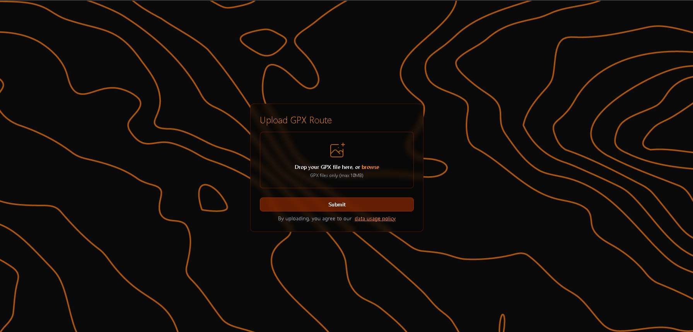

# Michigan Bike Maps
  
  []

  

[michiganbikemaps.com](https://www.michiganbikemaps.com)
  
  ## Description 
  
  This is the client application for the Michigan Bike Maps project to aims to offer route planning for cyclists across the state of Michigan. Currently we are in R & D, but are currently crowd sourcing GPX data from the community and performing research. Please consider contributing! \n\n The application in its current state is built with Svelte 5 and SvelteKit and uses a custom GPX Compressor wasm program to reduce file sizes as they are sent to an AWS S3 bucket.
  
  ## Table of Contents

  ⋆[Installation](#Installation)
  ⋆[Usage](#Usage)
  ⋆[Credits](#Credits)
  ⋆[License](#License)
  ⋆[Features](#Features)
  ⋆[Contributions](#Contributions)
  ⋆[Test](#Contributions)

  ## Installation 

  To play with this application locally you will need to have the Rust toolchain, Node > 20.0, and NPM.
  From github, download the source code through whatever route you see fit. Unzip the project, navigate to the root of the project in your CLI client and run:
  <pre> $ npm install </pre>
  To install the required dependencies for the root project. 
  Next, navigate to the gpx-file-processor-wasm directory in the project and run:
  <pre> $ cargo build </pre>
  To build the rust application and confirm environment compatibility.

  ## Usage

  After following the above installation instructions, navigate to the root of the project within your CLI client and run: 
  <pre> $ npm run dev </pre>
  The application should start up locally.

  ## Credits 

  Myles Walimaa, Brahm Van Houzen
  

  ## License

  (https://opensource.org/licenses/MIT)  

  ## Features

  - File compression

  ## Technologies

  - SvelteKit
  - TailwindCSS
  - WebAssembly
  - Rust
  - Netlify

  ## Contributions

  Please consider visiting [michiganbikemaps.com](https://www.michiganbikemaps.com) and uploading any and all gpx files you may have of you bicycle adventures!

  ## Questions

  If you have any questions about the project you can reach out to me via email or GitHub with the information below. 

  >Email: brahm@brahmvanhouzen.studio

  >GitHub: [brahmvanh](https://github.com/brahmvanh)
  